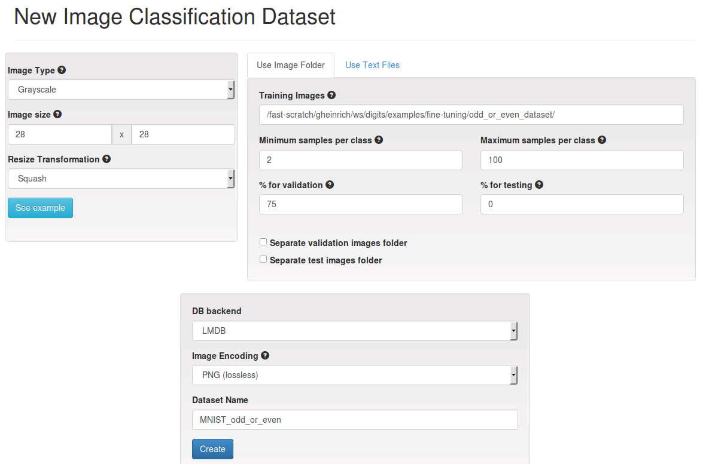
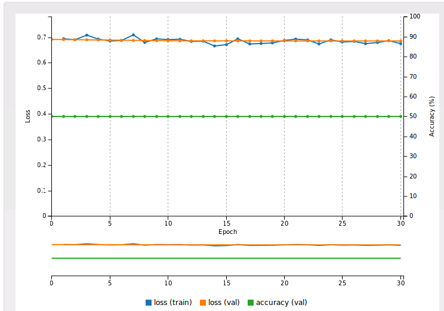
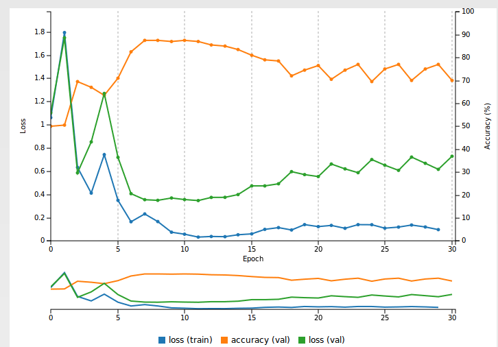
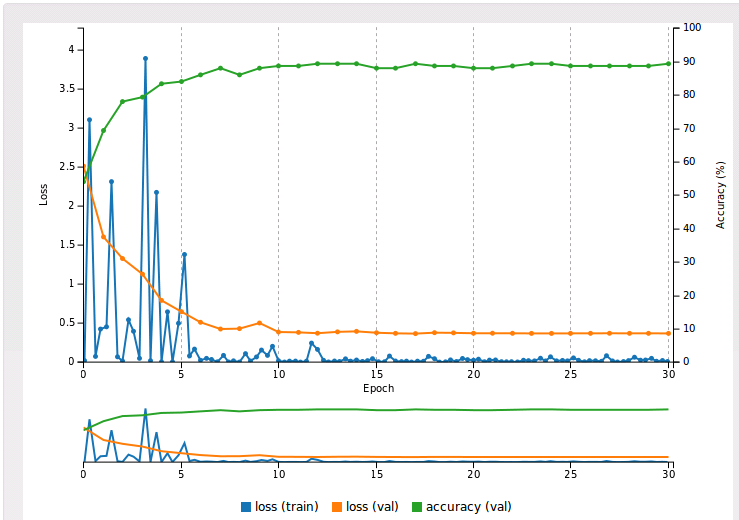

# Fine tuning a model using DIGITS

Table of Contents
=================
* [Introduction](#introduction)
* [Training the original model](#training-the-original-model)
* [Dataset creation](#dataset-creation)
* [Model creation](#model-creation)
    * [Using Caffe](#using-caffe)
    * [Using Torch7](#using-torch7)
* [Verification](#verification)

## Introduction

Fine tuning a model makes it possible to benefit from the features the model has learnt previously and apply these features to a new task.
This can be used to speed up training or this may be used to train a model on a reduced dataset that would otherwise be too small to allow the neural network to learn anything.
In this example we will demonstrate how a LeNet network that was trained on MNIST can be fine tuned to recognize odd or even numbers from a very small number of training samples.

## Training the original model

Follow the introductory walkthrough on [GettingStarted](../../docs/GettingStarted.md) to train an instance of LeNet on MNIST.

## Dataset Creation

We will need to create a new dataset that comprises two classes: one for images of odd numbers, one for images of even numbers.

Assuming you have a folder containing MNIST images, you may use the `create_dataset.sh` script to create the required directory structure into a folder called `odd_or_even_dataset`:
```sh
$ cd $DIGITS_HOME/examples/fine-tuning
$ ./create_dataset.sh odd_or_even_dataset <PATH_TO_MNIST_IMAGES>/train
```

Now in DIGITS create a new classification dataset. Select `grayscale` image type, `28x28` image size, and provide the path to the folder that was created by `create_dataset.sh`.
To illustrate the benefits of fine tuning we will intentionally reduce the amount of training samples: set the maximum samples per class to `100` and reserve `75%` of samples for validation:



## Model creation

You can try to train an instance of LeNet from scratch using the dataset you just created. Depending on how well weights are initialized the model might fare
more or less well. With Torch7 default weight initialization, the network is unable to learn anything (the loss function is flat and the accuracy after 30 epochs is close to 50%, i.e. similar to random guessing):



With Xavier initialization, the Caffe standard LeNet model performs much better however there is a substantial amount of overfit (the validation loss is much higher than the training loss):



Now we will see that it is possible to fine tune an instance of LeNet that was already trained on the full MNIST dataset and achieve higher accuracy and less overfit:
To this avail:
- go to the image classification model page
- select the dataset you just created
- in the `Previous networks` tab, select the instance of LeNet you wish to fine tune
- on the `Pretrained model` column, select the last epoch
- now click on `Customize`

### Using Caffe

In the `Custom network` text area, paste the contents of this [prototxt file](lenet-fine-tune.prototxt).
This description is similar to the standard LeNet model except for the following differences:
- the learning rate was set to zero for the original layers of the model, in order to keep the existing features unchanged
- a new `InnerProduct` layer called `ip2_odd_even` with two outputs was added on top of the network
- the accuracy layer was updated to compute the accuracy of `ip2_odd_even`

### Using Torch7

In the `Custom network` text area, paste the contents of this [Lua file](lenet-fine-tune.lua).
The description is similar to the standard LeNet model except for the following differences:
- a `fineTuneHook` was added
- the `fineTuneHook` hook sets the `accGradParameters` fields of the original layers to `nil` in order to keep the existing features unchanged
- the `fineTuneHook` adds a `nn.Linear(10, 2)` layer on top of the network

## Verification

Now if you give your network a name and click `Create` the loss function should go down very sharply and the validation accuracy should exceed 90%:



